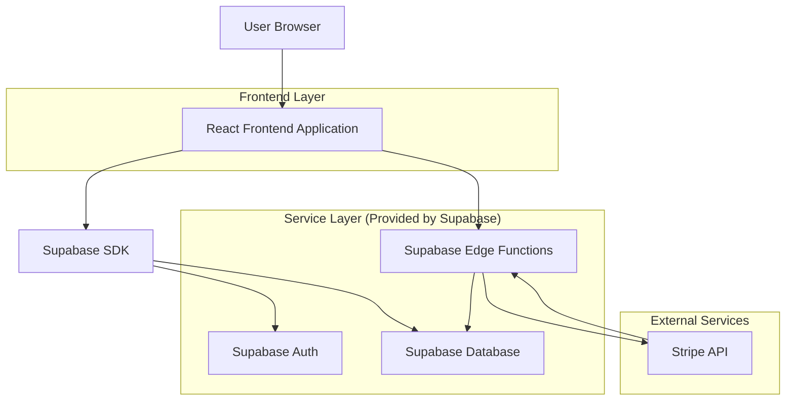
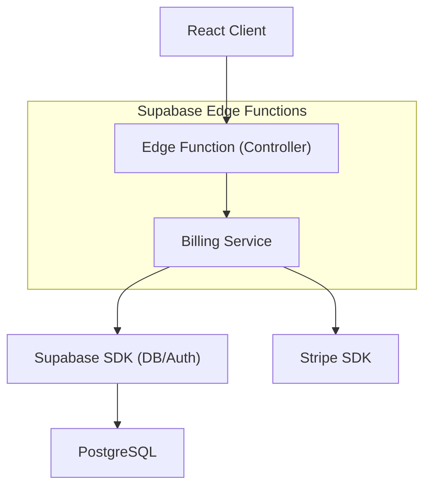
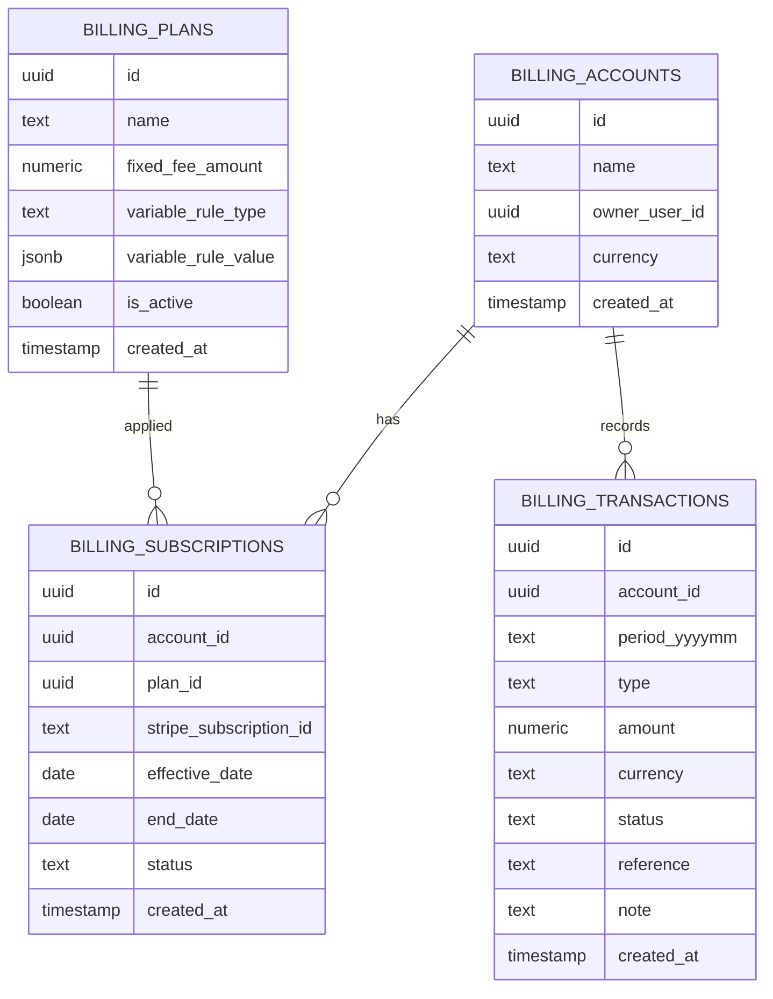

## 1.Architecture design


## 2.Technology Description
- Frontend: React@18 + TypeScript + tailwindcss@3 + vite
- Backend: Supabase (Auth + PostgreSQL + Storage) + Supabase Edge Functions
- Pagos (tasa fija / suscripción): Stripe (suscripciones)
- Notificaciones: In-app (tabla + realtime) y email (vía función/trigger)

## 3.Route definitions
| Route | Purpose |
|-------|---------|
| /login | Acceso y recuperación de cuenta (si aplica) |
| /billing | Dashboard de cobros dual: resumen, pendientes, registro de pago variable |
| /billing/settings | Configuración de planes, depósito inicial y reglas de notificación |
| /billing/reports | Reportes de rentabilidad y exportación |

## 4.API definitions (If it includes backend services)
### 4.1 Core API (Edge Functions)
Crear/gestionar suscripción (tasa fija)
```
POST /functions/v1/billing-create-subscription
```
Request
| Param Name | Param Type | isRequired | Description |
|---|---|---|---|
| accountId | string | true | Cuenta/propiedad objetivo |
| planId | string | true | Plan seleccionado |
| effectiveDate | string (ISO) | true | Fecha efectiva |

Response
| Param Name | Param Type | Description |
|---|---|---|
| checkoutUrl | string | URL de checkout/portal |

Webhook de Stripe (altas, renovaciones, cancelaciones)
```
POST /functions/v1/stripe-webhook
```

Notificaciones programadas (pendientes y vencimientos)
```
POST /functions/v1/billing-notify
```

### 4.2 Shared Types (TypeScript)
```ts
export type BillingPlan = {
  id: string;
  name: string;
  fixed_fee_amount: number; // tasa fija
  variable_rule_type: 'percentage' | 'table' | 'manual';
  variable_rule_value: Record<string, any>; // JSON
  is_active: boolean;
}

export type BillingTransaction = {
  id: string;
  account_id: string;
  period_yyyymm: string;
  type: 'deposit' | 'fixed_fee' | 'variable_payment' | 'adjustment';
  amount: number;
  currency: 'USD' | 'MXN';
  status: 'pending' | 'posted' | 'void';
  reference?: string;
  note?: string;
  created_at: string;
}
```

## 5.Server architecture diagram (If it includes backend services)


## 6.Data model(if applicable)

### 6.1 Data model definition


### 6.2 Data Definition Language
```
-- Planes
CREATE TABLE billing_plans (
  id UUID PRIMARY KEY DEFAULT gen_random_uuid(),
  name TEXT NOT NULL,
  fixed_fee_amount NUMERIC(12,2) NOT NULL DEFAULT 0,
  variable_rule_type TEXT NOT NULL CHECK (variable_rule_type IN ('percentage','table','manual')),
  variable_rule_value JSONB NOT NULL DEFAULT '{}'::jsonb,
  is_active BOOLEAN NOT NULL DEFAULT true,
  created_at TIMESTAMPTZ NOT NULL DEFAULT now()
);

-- Cuentas (propiedad/cliente)
CREATE TABLE billing_accounts (
  id UUID PRIMARY KEY DEFAULT gen_random_uuid(),
  name TEXT NOT NULL,
  owner_user_id UUID,
  currency TEXT NOT NULL DEFAULT 'MXN',
  created_at TIMESTAMPTZ NOT NULL DEFAULT now()
);

-- Suscripciones (tasa fija) (FKs lógicas, sin constraint físico)
CREATE TABLE billing_subscriptions (
  id UUID PRIMARY KEY DEFAULT gen_random_uuid(),
  account_id UUID NOT NULL,
  plan_id UUID NOT NULL,
  stripe_subscription_id TEXT,
  effective_date DATE NOT NULL,
  end_date DATE,
  status TEXT NOT NULL CHECK (status IN ('active','past_due','canceled','scheduled')),
  created_at TIMESTAMPTZ NOT NULL DEFAULT now()
);
CREATE INDEX idx_billing_subscriptions_account_id ON billing_subscriptions(account_id);

-- Movimientos: depósito, fijo, variable, ajustes
CREATE TABLE billing_transactions (
  id UUID PRIMARY KEY DEFAULT gen_random_uuid(),
  account_id UUID NOT NULL,
  period_yyyymm TEXT NOT NULL,
  type TEXT NOT NULL CHECK (type IN ('deposit','fixed_fee','variable_payment','adjustment')),
  amount NUMERIC(12,2) NOT NULL,
  currency TEXT NOT NULL,
  status TEXT NOT NULL CHECK (status IN ('pending','posted','void')),
  reference TEXT,
  note TEXT,
  created_at TIMESTAMPTZ NOT NULL DEFAULT now(),
  UNIQUE(account_id, period_yyyymm, type)
);
CREATE INDEX idx_billing_transactions_account_period ON billing_transactions(account_id, period_yyyymm);

-- Permisos base
GRANT SELECT ON billing_plans, billing_accounts, billing_subscriptions, billing_transactions TO anon;
GRANT ALL PRIVILEGES ON billing_plans, billing_accounts, billing_subscriptions, billing_transactions TO authenticated;
```
