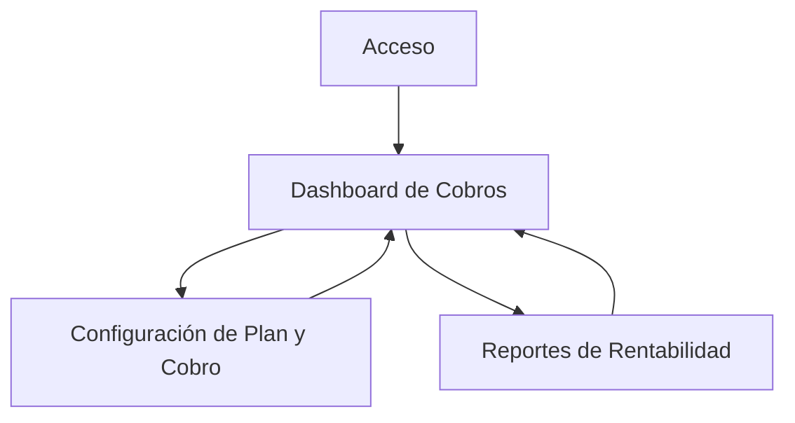

## 1. Product Overview
Módulo de cobro dual para administración de propiedades: una **tasa fija** (suscripción) y una **tasa variable** (pagos mensuales registrados manualmente).
Permite cambios de plan, depósito inicial, notificaciones operativas y reportes de rentabilidad por propiedad/cliente.

## 2. Core Features

### 2.1 User Roles
| Rol | Método de registro | Permisos principales |
|------|---------------------|----------------------|
| Operador/Admin | Invitación o alta interna | Configurar planes, registrar pagos variables, aplicar depósitos, cambiar planes, ver reportes y notificaciones |
| Supervisor/Owner (opcional) | Invitación | Ver estado de cobros y reportes de sus propiedades/cuentas |

### 2.2 Feature Module
El módulo requiere las siguientes páginas principales:
1. **Acceso**: iniciar sesión, recuperar acceso.
2. **Dashboard de Cobros**: resumen de suscripciones y pagos variables, estado del depósito, alertas/notificaciones.
3. **Configuración de Plan y Cobro**: definir tasa fija, reglas de tasa variable, depósito inicial, cambios de plan.
4. **Reportes de Rentabilidad**: rentabilidad por periodo, propiedad y plan; exportación básica.

### 2.3 Page Details
| Page Name | Module Name | Feature description |
|-----------|-------------|---------------------|
| Acceso | Login | Autenticar usuarios y mantener sesión activa. |
| Acceso | Recuperación | Enviar enlace/código de recuperación para restablecer acceso. |
| Dashboard de Cobros | Resumen | Mostrar KPIs: suscripción activa (sí/no), plan actual, monto fijo, estado de pago del mes, saldo/estatus de depósito. |
| Dashboard de Cobros | Registro rápido (variable) | Capturar pago mensual manual: periodo, monto, método, referencia, notas, adjunto opcional; validar duplicados por periodo. |
| Dashboard de Cobros | Línea de tiempo | Listar movimientos: depósito, cargos fijos, pagos variables, ajustes; filtrar por propiedad/cliente y rango de fechas. |
| Dashboard de Cobros | Notificaciones | Mostrar alertas por: depósito faltante, pago del mes pendiente, cambio de plan programado/aplicado, anomalías (monto fuera de rango). |
| Configuración de Plan y Cobro | Catálogo de planes | Crear/editar planes con: nombre, tarifa fija (suscripción), reglas de variable (porcentaje/tabla/rango), vigencia y notas. |
| Configuración de Plan y Cobro | Asignación de plan | Asignar plan a propiedad/cliente; aplicar fecha efectiva y prorrateo (si aplica); registrar motivo del cambio. |
| Configuración de Plan y Cobro | Depósito inicial | Definir monto requerido, fecha límite, estatus (pendiente/recibido/retornado), y registrar recepción manual con comprobante. |
| Configuración de Plan y Cobro | Reglas de notificación | Configurar umbrales mínimos: días antes de vencimiento y destinatarios (rol). |
| Reportes de Rentabilidad | Rentabilidad | Calcular y mostrar: ingresos (fijo+variable), costos/fees (si existen), margen y % margen por periodo y propiedad/cliente. |
| Reportes de Rentabilidad | Comparativos | Comparar periodos (mes vs mes) y planes (antes/después del cambio) con variaciones. |
| Reportes de Rentabilidad | Exportación | Exportar CSV/PDF básico de tablas principales del reporte. |

## 3. Core Process
**Flujo Operador/Admin**
1) Entra al sistema y abre Dashboard de Cobros.
2) Configura o selecciona un plan, define depósito inicial y reglas de notificación.
3) Asigna el plan a una propiedad/cliente (fecha efectiva); si hay cambio de plan, queda registrado con motivo.
4) Registra el depósito inicial cuando se reciba (manual), adjuntando comprobante.
5) Cada mes registra el pago variable manual (periodo y monto). El sistema valida duplicados y actualiza estatus.
6) El sistema emite notificaciones (en app / correo) por pendientes y eventos.
7) Consulta Reportes de Rentabilidad por periodo y exporta.

