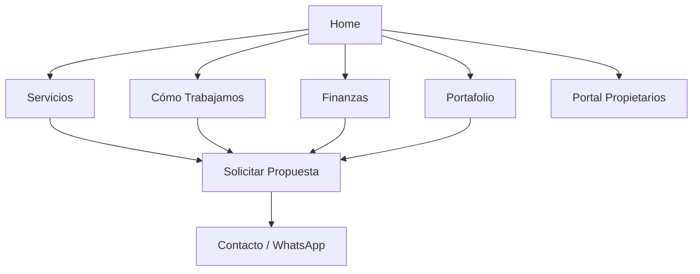

## 1. Product Overview
Plataforma web de gestión de propiedades residenciales de lujo y súper lujo en Los Cabos (Cabo San Lucas y San José del Cabo). El enfoque es la administración integral de residencias privadas, garantizando plusvalía, transparencia financiera y mantenimiento preventivo de alto nivel.

⚠️ **Restricción Clave**: NO se ofrecen servicios de renta vacacional (Airbnb/Booking) ni gestión de huéspedes temporales. El servicio es exclusivo para propietarios que buscan el cuidado impecable de su patrimonio.

## 2. Core Features

### 2.1 User Roles
| Role | Registration Method | Core Permissions |
|------|---------------------|------------------|
| Propietario | Invitación directa / Solicitud | Acceso a portal de propietarios, reportes financieros detallados, bitácoras de mantenimiento, aprobación de presupuestos |
| Staff Admin | Login interno | Gestión de tareas, carga de reportes, actualización de estados de mantenimiento |
| Visitante | Sin registro | Navegación informativa, solicitud de propuesta |

### 2.2 Feature Module
El sitio web consta de las siguientes secciones estratégicas:

1. **Home**: Propuesta de valor "Luxury Residential Management", diferenciadores (No rentas), y CTA para propietarios.
2. **Servicios**: Detalle de mantenimiento preventivo, gestión de staff, administración financiera y concierge para propietarios.
3. **Cómo Trabajamos**: Explicación de checklists, protocolos de seguridad y estándares de operación.
4. **Finanzas**: Transparencia total, cuentas separadas, reportes fiscales y fondos de reserva.
5. **Honorarios**: Explicación del modelo de "Fee Fijo Mensual" vs comisiones, garantizando objetividad.
6. **Portafolio**: Showcase de propiedades administradas (sin precios de renta), destacando años de gestión y servicios.
7. **Portal Propietarios**: Acceso privado a dashboards financieros y operativos.
8. **Contacto**: Formulario para propietarios e inversores.

### 2.3 Page Details
| Page Name | Module Name | Feature description |
|-----------|-------------|---------------------|
| Home | Hero Section | Imagen/Video de alta gama con mensaje de confianza y cuidado patrimonial. CTA "Solicitar Propuesta". |
| Home | Diferenciadores | Sección "Por qué no rentamos": Enfoque en seguridad y cuidado vs desgaste de rentas cortas. |
| Servicios | Mantenimiento | Checklists preventivos (diarios, semanales, mensuales). Coordinación de proveedores. |
| Servicios | Finanzas | Gestión de pagos de servicios, impuestos, nóminas y reportes contables. |
| Servicios | Concierge | Servicios exclusivos para el propietario y sus invitados personales (compras, chef, transporte). |
| Cómo Trabajamos | Procesos | Visualización del ciclo de inspección y reporte. Protocolos de huracanes. |
| Finanzas | Transparencia | Explicación de cuentas bancarias segregadas y auditoría de gastos. |
| Honorarios | Modelo de Negocio | Comparativa Fee Fijo vs % de Rentas. Transparencia en costos. |
| Portafolio | Showcase | Galería de residencias bajo administración. Énfasis en "Gestionada desde 20XX". |
| Contacto | Formulario | Perfilado de cliente (Propietario, Developer, Inversor). WhatsApp directo. |

## 3. Core Process

### Flujo Principal (Lead Propietario)
1. Propietario visita el sitio buscando administración confiable.
2. Lee sobre la filosofía "No Rentas" y Transparencia Financiera.
3. Visita la sección "Cómo Trabajamos" para entender el rigor operativo.
4. Solicita una "Propuesta de Administración" vía formulario o WhatsApp.
5. Se agenda visita técnica a la propiedad.

### Flujo Operativo (Propietario Existente)
1. Accede al Portal de Propietarios.
2. Visualiza el Estado de Cuenta del mes actual en tiempo real.
3. Revisa fotos/videos del último mantenimiento o reparación.
4. Aprueba presupuestos para mejoras o reparaciones mayores.

## 4. User Interface Design

### 4.1 Design Style
- **Colores**:
  - Primario: #712F34 (Bordó Profundo - Elegancia, Solidez)
  - Fondo: #F5F1EC (Crema - Calidez, Lujo orgánico)
  - Acento: #E5A663 (Oro Arena - Detalles premium)
  - Texto: #2C2C2C (Gris Oscuro - Legibilidad)
- **Tipografía**: Serif para títulos (elegancia clásica) y Sans-Serif moderna para cuerpos de texto.
- **Imágenes**: Fotografía de arquitectura y estilo de vida de alta gama. Evitar fotos de stock genéricas de turistas.
- **Iconografía**: Minimalista, líneas finas (Lucide React).

### 4.2 SEO y Performance
- **Keywords**: "Luxury Property Management Cabo", "Administración de Casas Los Cabos", "Mantenimiento Residencial Lujo".
- **Anti-Keywords**: Evitar términos como "Airbnb Management", "Vacation Rentals", "Booking".
- **Meta Tags**: Enfocados en confianza, seguridad, transparencia y plusvalía.
