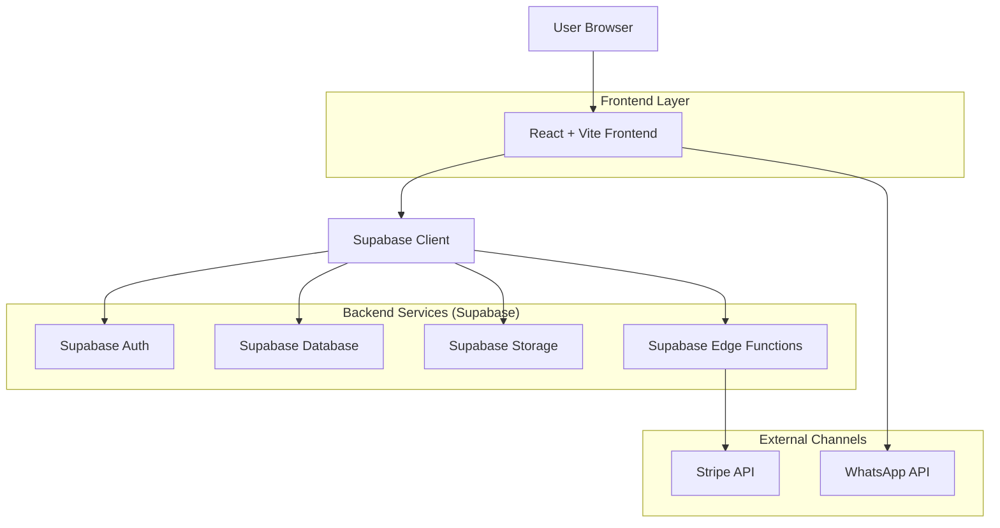
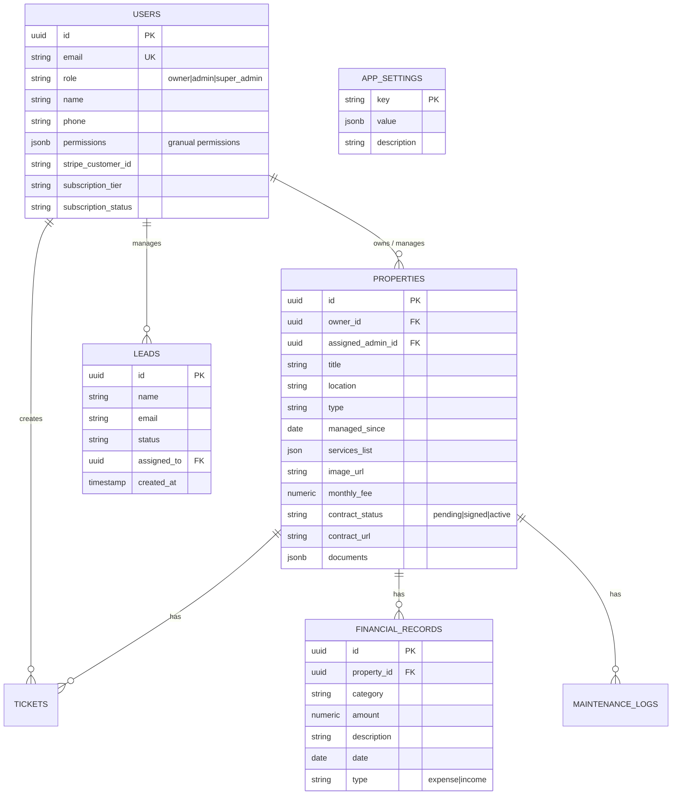

## 1. Architecture design



## 2. Technology Description

* **Frontend**: React 18 + Vite + TypeScript + React Router DOM
* **Styling**: Tailwind CSS + Lucide React (icons)
* **Backend**: Supabase (Auth, Database, Storage, Edge Functions)
* **Payments**: Stripe (Checkout & Customer Portal)
* **Deployment**: Vercel
* **State Management**: React Context (Settings) + Local State
* **Internationalization**: Custom Context (English/Spanish)

## 3. Route definitions

| Route            | Purpose                                            |
| ---------------- | -------------------------------------------------- |
| /                | Home: Value proposition and main access            |
| /servicios       | Details of maintenance, finance, and concierge     |
| /como-trabajamos | Processes, checklists, and security                |
| /finanzas        | Explanation of financial transparency model        |
| /honorarios      | Fee structure and fixed costs                      |
| /propiedades     | Portfolio of managed residences (Showcase)         |
| /contacto        | Contact form and location                          |
| /evaluacion      | (Redirects to Contact/Proposal Request)            |
| /propietarios    | Login to Owner Portal                              |
| /portal/*        | Protected routes for Owner Dashboard               |
| /admin/*         | Protected routes for Admin/Super Admin Dashboard   |
| /forgot-password | Password recovery                                  |

## 4. API definitions (Planned & Implemented)

### 4.1 Core API (Supabase)

**Authentication**
Standard Supabase Auth (Email/Password, Google OAuth).
* **Triggers**: Auto-sync between `auth.users` and `public.users`.

**Property Management**
Read/Write via Supabase Client with RLS policies.
* **Access Control**: Owners see their own properties; Admins see assigned properties; Super Admins see all.

**Edge Functions / RPC**
* `auto_assign_resources`: Database function to automatically assign leads and properties to admins based on configured strategy (Round Robin / Load Balancing).

```typescript
// Generate Stripe Session (Checkout or Portal)
POST /functions/v1/create-stripe-session
Headers: { Authorization: "Bearer <token>" }
Response: { url: "https://checkout.stripe.com/..." }
```

## 5. Data model

### 5.1 Data model definition



### 5.2 Database Schema (Supabase)

**Users Table (users)**
* Extends `auth.users`.
* **Roles**: `owner`, `admin`, `super_admin`.
* **Permissions**: JSONB column for granular access control (e.g., `{ "can_edit_fees": true, "can_assign_leads": false }`).
* **Triggers**: Automatic creation from Auth.

**Properties Table (properties)**
* `assigned_admin_id`: FK to `users` (Admin managing the property).
* `monthly_fee`: Monthly maintenance cost (USD).
* `contract_status`: Status of the contract ('pending', 'signed', 'active').
* `contract_url`: URL to the signed PDF contract in Storage.

**Leads Table (leads)**
* `assigned_to`: FK to `users` (Admin managing the lead).
* Supports auto-assignment via DB function.

**App Settings (app_settings)**
* Stores global configuration.
* Example: `{ "key": "assignment_config", "value": { "strategy": "load_balancing", "timeout_hours": 24 } }`.

**Storage Buckets**
* `property-images`: Property images and reports (Public/Authenticated).
* `documents`: Private contracts and sensitive files (Authenticated only, RLS protected).

### 5.3 Automated Logic

**Auto-Assignment System**
* **Function**: `auto_assign_resources()`
* **Logic**: Assigns unassigned properties and leads to admins.
* **Strategies**:
    * `round_robin`: Rotates assignments sequentially among admins.
    * `load_balancing`: Assigns to the admin with the fewest current active assignments.
* **Trigger**: Can be called manually by Super Admin or scheduled via Cron/Edge Function.
