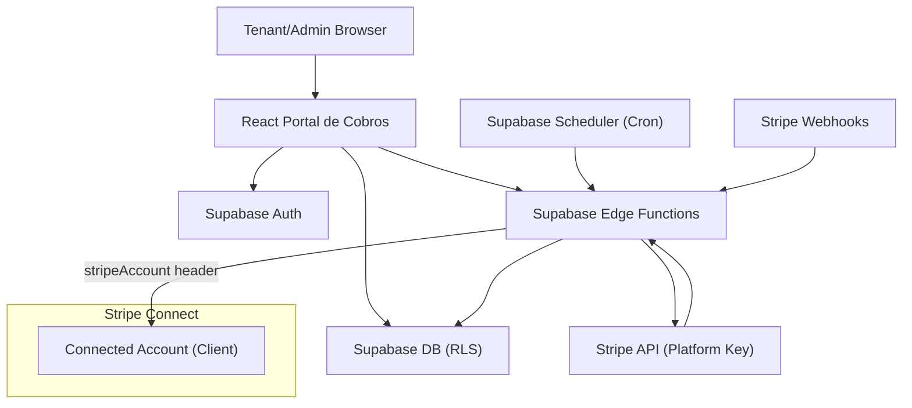

## 1. Architecture design


## 2. Tecnología
- Frontend: React + TypeScript + Vite + Tailwind
- Pago (tenant): Stripe Elements + SetupIntent (sin PAN/CVC en app)
- Backend: Supabase (DB + RLS + Edge Functions + Scheduler)
- Cobro recurrente: app-driven (cron) con PaymentIntents `off_session` en connected account

## 3. Stripe Connect (Standard)
- Se guarda `stripe_connected_account_id` por `client`.
- Todas las operaciones financieras se ejecutan con `stripeAccount = stripe_connected_account_id`.
- Los depósitos/disputas/reembolsos quedan en el dashboard del cliente.

## 4. API (Edge Functions)
### 4.1 Tenant: iniciar registro de método de pago
```
POST /functions/v1/tenant-create-setup-intent
```
Request:
- `leaseId`

Response:
- `clientSecret`
- `customerId`

### 4.2 Tenant: confirmar método (solo DB)
El confirm ocurre en frontend con `Elements`. El webhook sincroniza estado.

### 4.3 Admin: cobrar ahora
```
POST /functions/v1/admin-charge-now
```
Request:
- `leaseId`
- `amountCents` (opcional override)
- `currency` (opcional)

### 4.4 Scheduler: correr cobros del día
```
POST /functions/v1/autopay-run-daily
```

### 4.5 Webhook
```
POST /functions/v1/stripe-webhook
```
Verifica firma y procesa eventos relevantes.

## 5. Modelo de datos
- `clients`: stripe_connected_account_id por cliente.
- `properties`: pertenecen a un client.
- `leases`: reglas de cobro (día, monto, moneda, autopay).
- `tenant_payment_profiles`: customer + payment_method dentro del connected account.
- `payment_attempts`: histórico de intentos (idempotente por periodo/attempt).
- `stripe_webhook_events`: deduplicación e historial de eventos.
- `audit_logs`: auditoría de acciones de admins.

