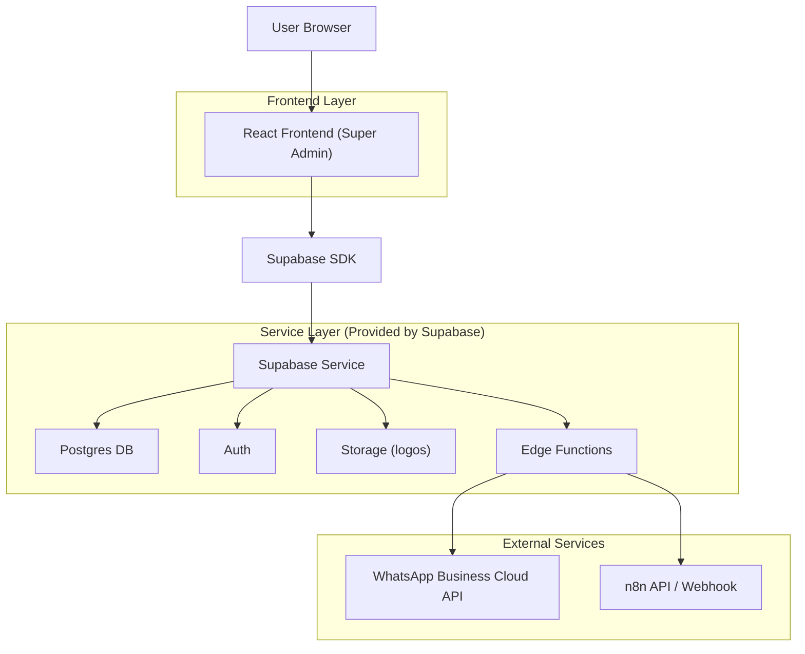
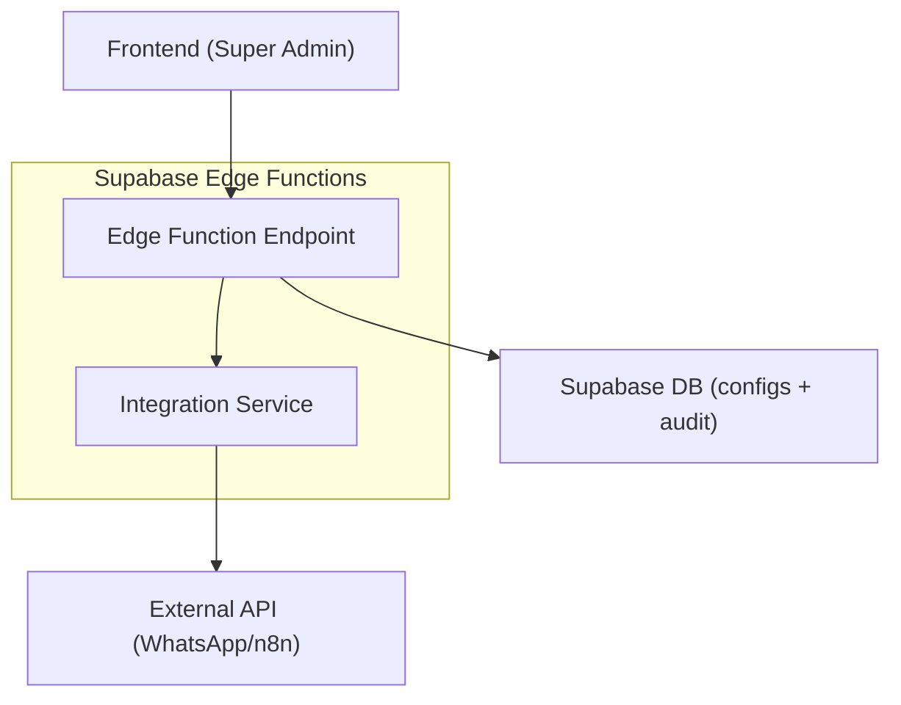
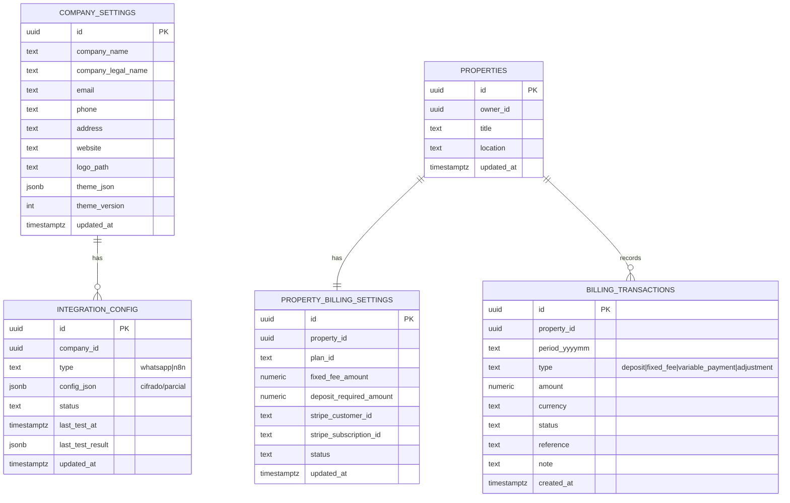

## 1.Architecture design


## 2.Technology Description
- Frontend: React@18 + TypeScript + vite + tailwindcss@3
- Backend: Supabase (Auth, Postgres, Storage, Edge Functions)
- UI/Forms: react-hook-form + zod
- Paleta desde logo: node-vibrant (cliente) + fallback manual
- Cobros: Stripe (suscripción/tasa fija) + registro manual de pago variable (DB)
- Testing: vitest + @testing-library/react + playwright

## 3.Route definitions
| Route | Purpose |
|-------|---------|
| /login | Acceso Super Admin y recuperación de sesión |
| /super-admin | Consola Super Admin (tabs: resumen, propiedades, empresa-marca, integraciones, vista-previa, pruebas-docs) |
| /super-admin/properties | Listado de propiedades (búsqueda, filtros, acceso a detalle) |
| /super-admin/properties/:propertyId | Detalle de propiedad (tabs; incluye Cobros) |

## 4.API definitions (If it includes backend services)
### 4.1 Edge Functions (seguridad, pruebas de conexión y cobros)
**Probar conexión WhatsApp**
```
POST /functions/v1/integrations-whatsapp-test
```
Request (TypeScript):
```ts
type WhatsappTestRequest = {
  wabaId: string;
  phoneNumberId: string;
  accessToken: string; // enviado solo para test; no se loguea
};
```
Response:
```ts
type IntegrationTestResponse = {
  ok: boolean;
  message: string;
  details?: Record<string, unknown>;
  testedAt: string; // ISO
};
```

**Probar conexión n8n**
```
POST /functions/v1/integrations-n8n-test
```
Request:
```ts
type N8nTestRequest = { baseUrl: string; apiKey?: string; webhookUrl?: string };
```
Response: `IntegrationTestResponse`

**Crear sesión de Stripe (checkout/portal) para cobros de una propiedad**
```
POST /functions/v1/billing-create-stripe-session
```
Request (TypeScript):
```ts
type BillingCreateStripeSessionRequest = {
  propertyId: string;
  mode: 'checkout' | 'portal';
  planId?: string; // requerido si mode=checkout
};
```
Response:
```ts
type BillingCreateStripeSessionResponse = { url: string };
```

> Nota: Los tokens/keys deben almacenarse cifrados en DB y con RLS estricto; los logs deben redactar secretos.

## 5.Server architecture diagram (If it includes backend services)


## 6.Data model(if applicable)
### 6.1 Data model definition


### 6.2 Data Definition Language
```sql
CREATE TABLE company_settings (
  id UUID PRIMARY KEY DEFAULT gen_random_uuid(),
  company_name TEXT NOT NULL,
  company_legal_name TEXT,
  email TEXT,
  phone TEXT,
  address TEXT,
  website TEXT,
  logo_path TEXT,
  theme_json JSONB NOT NULL DEFAULT '{}'::jsonb,
  theme_version INT NOT NULL DEFAULT 1,
  updated_at TIMESTAMPTZ NOT NULL DEFAULT now()
);

CREATE TABLE integration_config (
  id UUID PRIMARY KEY DEFAULT gen_random_uuid(),
  company_id UUID NOT NULL,
  type TEXT NOT NULL CHECK (type IN ('whatsapp','n8n')),
  config_json JSONB NOT NULL DEFAULT '{}'::jsonb,
  status TEXT NOT NULL DEFAULT 'disabled',
  last_test_at TIMESTAMPTZ,
  last_test_result JSONB,
  updated_at TIMESTAMPTZ NOT NULL DEFAULT now()
);

CREATE INDEX idx_integration_config_company_type ON integration_config(company_id, type);

-- Cobros por propiedad (config dentro de Gestión de Propiedades)
CREATE TABLE property_billing_settings (
  id UUID PRIMARY KEY DEFAULT gen_random_uuid(),
  property_id UUID NOT NULL,
  plan_id TEXT,
  fixed_fee_amount NUMERIC(12,2) NOT NULL DEFAULT 0,
  deposit_required_amount NUMERIC(12,2) NOT NULL DEFAULT 0,
  stripe_customer_id TEXT,
  stripe_subscription_id TEXT,
  status TEXT NOT NULL DEFAULT 'inactive',
  updated_at TIMESTAMPTZ NOT NULL DEFAULT now(),
  UNIQUE(property_id)
);
CREATE INDEX idx_property_billing_settings_property_id ON property_billing_settings(property_id);

CREATE TABLE billing_transactions (
  id UUID PRIMARY KEY DEFAULT gen_random_uuid(),
  property_id UUID NOT NULL,
  period_yyyymm TEXT NOT NULL,
  type TEXT NOT NULL CHECK (type IN ('deposit','fixed_fee','variable_payment','adjustment')),
  amount NUMERIC(12,2) NOT NULL,
  currency TEXT NOT NULL,
  status TEXT NOT NULL CHECK (status IN ('pending','posted','void')),
  reference TEXT,
  note TEXT,
  created_at TIMESTAMPTZ NOT NULL DEFAULT now(),
  UNIQUE(property_id, period_yyyymm, type)
);
CREATE INDEX idx_billing_transactions_property_period ON billing_transactions(property_id, period_yyyymm);

-- Permisos (guía mínima)
GRANT SELECT ON company_settings TO anon;
GRANT ALL PRIVILEGES ON company_settings TO authenticated;
GRANT ALL PRIVILEGES ON integration_config TO authenticated;
GRANT ALL PRIVILEGES ON property_billing_settings, billing_transactions TO authenticated;
```

**RLS (resumen):**
- `company_settings`: lectura pública solo de `theme_json/logo_path` (vía vista o política por columnas) para que los portales consuman el tema.
- `integration_config`: acceso solo para Super Admin autenticado (sin exposición a anon).
- Auditoría: tabla separada `audit_log` con escritura por triggers/app y lectura restringida a Super Admin.