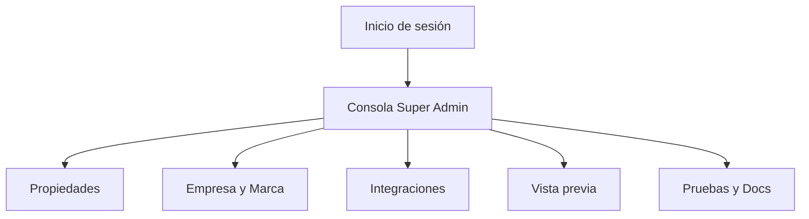

## 1. Product Overview
Consola **Super Admin** para configurar integraciones (WhatsApp y n8n) y la **marca global** (logo + paleta) aplicada a todos los portales.
Centraliza persistencia, validación, pruebas de conexión y documentación operativa para asegurar consistencia y control.

## 2. Core Features

### 2.1 User Roles
| Rol | Método de registro | Permisos principales |
|------|---------------------|----------------------|
| Super Admin | Usuario pre-creado o por invitación interna | Acceso total a integraciones, marca global, datos de empresa, pruebas, y auditoría |

### 2.2 Feature Module
1. **Inicio de sesión**: autenticación, recuperación de contraseña.
2. **Consola Super Admin**: navegación por secciones, estado del sistema, **gestión de propiedades (incluye configuración de cobros por propiedad)**, gestión de integraciones (WhatsApp/n8n), configuración general (datos de empresa + logo), extracción automática de paleta, ajustes manuales, vista previa de portales, persistencia y auditoría, pruebas y documentación.

### 2.3 Page Details
| Page Name | Module Name | Feature description |
|-----------|-------------|---------------------|
| Inicio de sesión | Autenticación | Iniciar sesión con credenciales; mantener sesión; cerrar sesión. |
| Inicio de sesión | Recuperación | Enviar enlace de recuperación; establecer nueva contraseña. |
| Consola Super Admin | Navegación | Cambiar entre secciones: Resumen, Propiedades, Empresa y Marca, Integraciones, Vista previa, Pruebas/Docs. |
| Consola Super Admin | Datos de empresa | Editar y guardar: nombre comercial/legal, email, teléfono, dirección, web; validar formatos obligatorios. |
| Consola Super Admin | Logo (subida) | Subir logo (PNG/JPG/SVG según política); validar tamaño/peso; reemplazar; mostrar miniatura. |
| Consola Super Admin | Extracción automática de paleta | Generar paleta desde el logo; proponer roles de color (primary/secondary/accent/bg/text/surface); permitir regenerar. |
| Consola Super Admin | Ajuste manual de paleta | Editar colores con picker + inputs HEX; bloquear roles; validar contraste mínimo (alertar si falla). |
| Consola Super Admin | Aplicación global a portales | Guardar “tema global” versionado; aplicar a todos los portales; registrar fecha/autor del cambio. |
| Consola Super Admin | Vista previa | Previsualizar componentes clave del portal con la paleta (header, botones, cards, texto); comparar “Antes/Después”. |
| Consola Super Admin | Integración WhatsApp | Configurar credenciales/IDs y webhook; validar campos; habilitar/deshabilitar; mostrar estado. |
| Consola Super Admin | Integración n8n | Configurar base URL/API key o webhook URL; validar URL; habilitar/deshabilitar; mostrar estado. |
| Consola Super Admin | Gestión de propiedades | Listar propiedades; buscar/filtrar; abrir detalle de propiedad. |
| Consola Super Admin | Cobros por propiedad | Configurar/actualizar cobros desde el detalle de propiedad: plan/tarifa fija, depósito inicial (estatus + comprobante), registro de pago variable mensual (manual) y enlace a portal/checkout de Stripe (si aplica). |
| Consola Super Admin | Pruebas de integración | Ejecutar “Probar conexión” (WhatsApp/n8n); mostrar resultado y detalle; guardar último resultado. |
| Consola Super Admin | Persistencia y auditoría | Persistir configuraciones; registrar cambios (qué cambió, quién, cuándo); mostrar historial reciente. |
| Consola Super Admin | Documentación | Mostrar guía corta: cómo obtener credenciales, cómo probar, límites y troubleshooting. |

## 3. Core Process
**Flujo Super Admin (marca):** Inicias sesión → vas a “Empresa y Marca” → subes logo → el sistema extrae paleta automática → ajustas manualmente si hace falta → previsualizas → guardas y publicas el tema global → el tema queda persistido y se aplica en todos los portales.

**Flujo Super Admin (integraciones):** Inicias sesión → vas a “Integraciones” → completas datos de WhatsApp/n8n → validas → ejecutas “Probar conexión” → si es OK habilitas → guardas → queda persistido con auditoría y último estado.

**Flujo Super Admin (cobros por propiedad):** Inicias sesión → vas a “Propiedades” → abres una propiedad → entras a la pestaña “Cobros” → asignas/actualizas plan → registras depósito (si aplica) → registras pago variable del mes (manual) → (si hay suscripción fija) generas enlace de checkout/portal de Stripe → guardas → queda persistido con auditoría.

